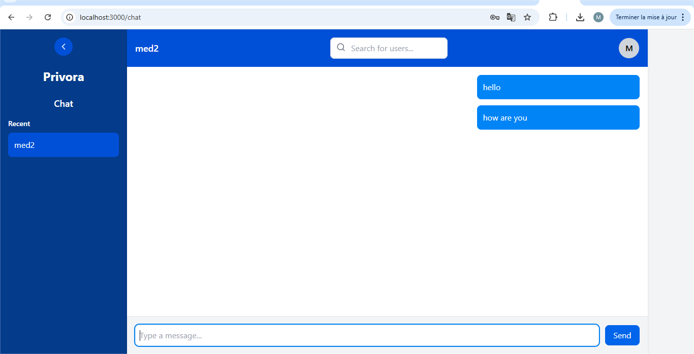

# 🛡️ Privora-GUI

**Privora** is a secure, privacy-focused chat application.  
This repository contains the **frontend user interface**, built with **React**, **TypeScript**, and **Tailwind CSS**, and designed to run inside a Docker container.

---

## 📑 Table of Contents

- [About the Project](#-about-the-project)
- [Prerequisites](#-prerequisites)
- [Clone the Repository](#-clone-the-repository)
- [Environment Configuration](#️-environment-configuration)
  - [Firebase Configuration](#-firebase-configuration-required)
- [Getting Started with Docker](#-getting-started-with-docker)
- [Live Coding / Dev Mode](#-live-coding--dev-mode)
- [Project Structure](#️-project-structure)
- [Backend Repository](#-backend-repository)
- [Screenshots](#️-screenshots)
- [License](#-license)

---

## 📦 About the Project

This is the graphical user interface (GUI) for the Privora chat app, focusing on:

- 💬 Secure messaging
- ⚛️ Modern UI with React
- 🎨 Tailwind-powered styling
- 🐳 Seamless Docker-based development

---

## 🔧 Prerequisites

Before you begin, ensure you have:

- **Git** - For cloning the repository
- **Docker** - For running the containerized app
- **Node.js** (v16+) - Optional, only needed for Firebase CLI or local development
- **Firebase Account** - Required for authentication features

---

## 🔄 Clone the Repository

To clone the project to your local machine, run the following command:

```bash
git clone https://github.com/med1001/Privora-GUI
```

Then navigate into the project directory:

```bash
cd Privora-GUI
```

---

## ⚙️ Environment Configuration

Before running the project, you need to create a `.env` file in the root directory.

You can start by copying the provided template:

```bash
cp .env.example .env
```

> ⚠️ **Note:** If `.env.example` doesn't exist in the repository, create a `.env` file manually with the variables below.

Then edit the `.env` file to match your environment.

#### Example for Local Development

If you're running the backend locally (e.g., with `localhost:8000`), your `.env` file might look like this:

```env
REACT_APP_API_URL=http://localhost:8000
REACT_APP_WS_URL=ws://localhost:8000/ws/
```

These variables allow the app to connect to your desired API and WebSocket server, whether you're running locally or in production.

---

### 🔥 Firebase Configuration Required

Before building the project (especially in Docker), you must create a Firebase config file for authentication to work.

#### Prerequisites

- **Node.js** (v16 or higher) - Required to run `npx` commands
- A **Firebase project** with **Authentication** enabled
- A **Web app** registered in your Firebase project

> 💡 **Don't want to install Node.js on your host?** You can run these commands inside a Node Docker container (see below).

---

#### Method 1: Manual Configuration (Recommended for Beginners)

1. **Copy the example config:**
   ```bash
   cp src/firebase-config.example.ts src/firebase-config.ts
   ```

2. **Get your Firebase credentials manually:**
   - Go to [Firebase Console](https://console.firebase.google.com/)
   - Select your project (or create one)
   - Navigate to: **Project Settings → General → Your apps**
   - If you don't have a web app, click **Add app** and select **Web** (</> icon)
   - Scroll to **SDK setup and configuration**
   - Copy the configuration object

3. **Paste the credentials** into `src/firebase-config.ts`

4. **Enable Firebase Authentication:**
   - In Firebase Console, go to **Authentication → Sign-in method**
   - Enable your desired providers (Email/Password, Google, etc.)

---

#### Method 2: Using Firebase CLI (Terminal Way)

This method uses the Firebase CLI to retrieve your configuration automatically.

##### Option A: Run on Host Machine

1. **Install Node.js** (if not already installed):
   - [Download Node.js](https://nodejs.org/) (v16 or higher)

2. **Login to Firebase:**
   ```bash
   npx firebase-tools login --no-localhost
   ```
   This will open your browser for authentication.

3. **List your Firebase projects:**
   ```bash
   npx firebase-tools projects:list
   ```
   Note your project ID (e.g., `my-project-123`).

4. **List your web apps:**
   ```bash
   npx firebase-tools apps:list --project my-project-123
   ```
   Make sure you have a web app registered. If not, create one in the Firebase Console.

5. **Get SDK configuration:**
   ```bash
   npx firebase-tools apps:sdkconfig web --project my-project-123
   ```
   This will output your Firebase configuration.
   
   then
   
   ```bash
   cp src/firebase-config.example.ts src/firebase-config.ts
   ```
   
   and paste the firebase credentials displayed by the npx firebase-tools command correctly in the firebase-config.ts 

##### Option B: Run in Docker (No Host Pollution)

If you don't want to install Node.js on your host machine, run the commands in a temporary Node container:

1. **Start an interactive Node container:**
   ```bash
   docker run -it --rm -v ${PWD}:/app -w /app node:18 bash
   ```

2. **Inside the container, run the Firebase commands:**
   ```bash
   npx firebase-tools login --no-localhost
   npx firebase-tools projects:list
   npx firebase-tools apps:list --project my-project-123
   npx firebase-tools apps:sdkconfig web --project my-project-123
   ```

3. **Copy the output** to your clipboard and paste it into `src/firebase-config.ts` on your host machine (outside the container).

4. **Exit the container:**
   ```bash
   exit
   ```

---

#### ⚠️ Important Security Notes

- **Never commit** your real `firebase-config.ts` to version control
- The file is already listed in `.gitignore` for safety
- Keep your Firebase API keys secure (though they're meant for client-side use, restrict them in Firebase Console)

#### 🔒 Restrict Your Firebase API Key (Recommended)

To prevent unauthorized use:

1. Go to [Google Cloud Console](https://console.cloud.google.com/)
2. Navigate to **APIs & Services → Credentials**
3. Find your Firebase API key
4. Click **Edit** and add **Application restrictions** and **API restrictions**
5. Limit to your domain(s) and necessary Firebase APIs

---

#### Verify Your Setup

After configuration, your `src/firebase-config.ts` should look like:

```typescript
import { initializeApp } from 'firebase/app';
import { getAuth } from 'firebase/auth';

const firebaseConfig = {
  apiKey: "AIzaSyXXXXXXXXXXXXXXXXXXXXXXXXXXXXX",
  authDomain: "your-project.firebaseapp.com",
  projectId: "your-project-123",
  storageBucket: "your-project-123.appspot.com",
  messagingSenderId: "123456789012",
  appId: "1:123456789012:web:abcdef123456"
};

const app = initializeApp(firebaseConfig);
export const auth = getAuth(app);
```

Now you're ready to build and run the project! 🚀

---

## 🐳 Getting Started with Docker

### 1. Build the Docker Image

```bash
docker build -t privora-gui .
```

### 2. Run the Container

```bash
docker run -p 3000:80 privora-gui
```

Then open your browser at:  
👉 [http://localhost:3000](http://localhost:3000)

---

## 🔁 Live Coding / Dev Mode (Linux only)

This project supports **live coding (hot reload)** using a dedicated **development Docker image**.

> ⚠️ Important  
> The default `Dockerfile` runs the app in **production mode** (static build served by Nginx).  
> For live reload during development, you **must** use `Dockerfile.dev`.

---

### 🐳 Development with Docker (Linux)

#### 1️⃣ Build the development image

```bash
docker build -f Dockerfile.dev -t privora-gui-dev .
```

#### 2️⃣ Run the development container with hot reload

```bash
docker run \
  -p 3000:3000 \
  -v ${PWD}:/app \
  -v /app/node_modules \
  -e CHOKIDAR_USEPOLLING=true \
  privora-gui-dev
```

Then open your browser at:  
👉 http://localhost:3000

---

### ✅ What this setup provides

- Edit the source code directly on your host machine
- Instant hot reload in the browser
- React runs in development mode (`npm start`)
- `node_modules` is isolated inside the container

---

### 🛑 Production note

For production usage, use the default `Dockerfile`, which builds the app and serves it with Nginx.

---

## 🗂️ Project Structure

```
Privora-GUI/
├── LICENSE               # Project license
├── README.md             # This documentation file
├── node_modules/         # Installed dependencies (ignored by Git)
├── package-lock.json     # NPM lock file to ensure consistent installs
├── package.json          # Project dependencies and scripts
├── postcss.config.js     # PostCSS configuration (used by Tailwind CSS)
├── public/               # Public static files (e.g., index.html, favicon)
├── src/                  # React source code (components, hooks, etc.)
├── tailwind.config.js    # Tailwind CSS configuration
├── tsconfig.json         # TypeScript configuration
```

---

## 🔙 Backend Repository

You can find the backend source code here:  
👉 [Privora Backend](https://github.com/med1001/Privora)

---

## 🖼️ Screenshots

### 🔐 Authentication Page


### 💬 Chat Interface



---

## 📄 License

GNU General Public License v3.0 — see the [LICENSE](./LICENSE) file.
