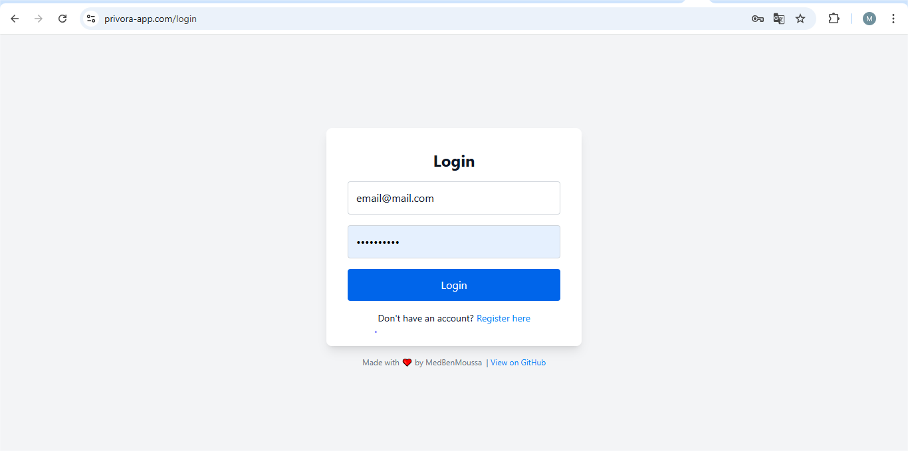
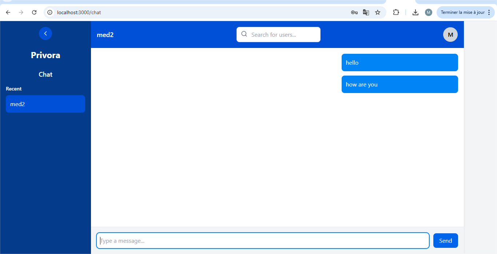

<div align="center">

# 🛡️ Privora-GUI

### Frontend Interface for Privora Chat Application

**Built with React • TypeScript • Tailwind CSS • Docker**

> 💡 **Note:** This is the **frontend (GUI)** repository. For the backend server, see [Privora Backend](https://github.com/med1001/Privora).

**Full stack (clone GUI + backend + reverse proxy in one tree):** [Privora-Workspace](https://github.com/med1001/Privora-Workspace) — git submodules + `docker compose` for localhost. Stars stay on the original repos.

[](https://github.com/med1001/Privora-Workspace)
[](https://www.gnu.org/licenses/gpl-3.0)
[](https://reactjs.org/)
[](https://www.typescriptlang.org/)
[](https://www.docker.com/)
[](https://tailwindcss.com/)

[Features](#-features) •
[Prerequisites](#-prerequisites) •
[Quick Start](#-quick-start) •
[Documentation](#-documentation) •
[Screenshots](#-screenshots) •
[License](#-license)

---

</div>

<br>

## 📑 Table of Contents

- [✨ Features](#-features)
- [🔧 Prerequisites](#-prerequisites)
- [🚀 Quick Start](#-quick-start)
  - [Clone Repository](#1-clone-the-repository)
  - [Environment Setup](#2-environment-configuration)
  - [Firebase Configuration](#3-firebase-configuration)
  - [Docker Setup](#4-build--run-with-docker)
- [💻 Development Mode](#-development-mode-linux-only)
- [🗂️ Project Structure](#️-project-structure)
- [📚 Documentation](#-documentation)
- [🖼️ Screenshots](#️-screenshots)
- [🤝 Contributing](#-contributing)
- [📄 License](#-license)
- [⭐ Support](#-support-the-project)

<br>

---

<br>

## ✨ Features

> 🎨 **This repository contains the frontend interface only**
> 
> For full functionality, you need to run the [Privora Backend](https://github.com/med1001/Privora) server.

<table>
<tr>
<td width="50%">

### 🖥️ Frontend UI
- Modern React interface with TypeScript
- Real-time chat interface
- User search and discovery
- Responsive design with Tailwind CSS

</td>
<td width="50%">

### 🔐 Authentication
- Firebase Authentication integration
- Secure login/signup flows
- Token-based auth with backend
- Session management

</td>
</tr>
<tr>
<td width="50%">

### 💬 Real-Time Messaging
- WebSocket client for live chat
- Instant message delivery
- Typing indicators
- Message history display

</td>
<td width="50%">

### 🐳 Docker Ready
- Containerized frontend app
- Development mode with hot reload
- Production-ready Nginx setup
- Easy deployment

</td>
</tr>
</table>

<br>

**🔌 Backend Required:**
This frontend connects to the backend via:
- **REST API** for user search (`/search-users`)
- **WebSocket** for real-time messaging (`/ws`)
- **Firebase** for authentication

**Configuration:**
- Development: `http://` and `ws://` (localhost only)
- **Production: `https://` and `wss://` (mandatory for security)**

Make sure to configure `REACT_APP_API_URL` and `REACT_APP_WS_URL` to point to your running backend server.

<br>

---

<br>

## 🏗️ Architecture Overview

Privora is a **two-part application**:

```
┌─────────────────────────────────────────────────────────────┐
│                     Privora Chat System                      │
├──────────────────────────────┬──────────────────────────────┤
│   Frontend (This Repo)       │   Backend (Separate Repo)    │
│   🎨 Privora-GUI             │   ⚙️ Privora                 │
├──────────────────────────────┼──────────────────────────────┤
│ • React + TypeScript         │ • REST API Server            │
│ • User Interface             │ • WebSocket Server           │
│ • Firebase Auth Client       │ • Firebase Auth Validation   │
│ • WebSocket Client           │ • Message Routing            │
│ • Docker Container           │ • Database Storage           │
└──────────────────────────────┴──────────────────────────────┘
              ↓                            ↓
    [Port 3000 (dev)]              [Port 8000 (dev)]
    [Port 80/443 (prod)]           [Port 80/443 (prod)]
              ↓                            ↓
         Browser ←──── HTTPS/WSS (prod) ───┤
                  └──── HTTP/WS (dev) ─────┘
```

**🔗 Communication:**

| Environment | REST API | WebSocket | Security |
|-------------|----------|-----------|----------|
| **Development** | `http://localhost:8000` | `ws://localhost:8000/ws` | ⚠️ No encryption |
| **Production** | `https://your-domain.com` | `wss://your-domain.com/ws` | ✅ TLS/SSL encrypted |

> ⚠️ **Important:** 
> - Both frontend and backend must be running for the app to work properly
> - **Production must use HTTPS and WSS** for secure communication

<br>

---

<br>

## 🔧 Prerequisites

Before you begin, ensure you have the following installed:

| Tool | Version | Purpose | Download |
|------|---------|---------|----------|
| **Git** | Latest | Clone repository | [Download](https://git-scm.com/download/win) |
| **Docker** | Latest | Run containerized app | [Download](https://www.docker.com/products/docker-desktop) |
| **Node.js** | v16+ | *Optional* - Firebase CLI | [Download](https://nodejs.org/) |
| **Firebase Account** | - | Authentication | [Sign Up](https://firebase.google.com/) |

> 💡 **Note:** Node.js is optional if you use Docker for Firebase CLI (see [Method 2B](#option-b-run-in-docker-no-host-pollution))

<br>

---

<br>

## 🚀 Quick Start

### **1.** Clone the Repository

```bash
git clone https://github.com/med1001/Privora-GUI
cd Privora-GUI
```

<br>

### **2.** Environment Configuration

Create your environment file:

```bash
cp .env.example .env
```

> ⚠️ If `.env.example` doesn't exist, create `.env` manually

<br>

**Edit `.env` with your configuration:**

**For Development (Local):**
```env
# Backend API Configuration (Development)
REACT_APP_API_URL=http://localhost:8000
REACT_APP_WS_URL=ws://localhost:8000/ws/
```

**For Production:**
```env
# Backend API Configuration (Production - Must use HTTPS/WSS)
REACT_APP_API_URL=https://api.yourdomain.com
REACT_APP_WS_URL=wss://api.yourdomain.com/ws/
```

> ⚠️ **Security Warning:** Production environments **MUST** use HTTPS and WSS (WebSocket Secure) for encrypted communication.

<details>
<summary><b>📝 Environment Variables Explained</b></summary>

<br>

| Variable | Description | Development | Production |
|----------|-------------|-------------|------------|
| `REACT_APP_API_URL` | Backend REST API endpoint | `http://localhost:8000` | `https://api.yourdomain.com` |
| `REACT_APP_WS_URL` | WebSocket server URL | `ws://localhost:8000/ws/` | `wss://api.yourdomain.com/ws/` |

**Protocol Requirements:**
- **Development:** `http://` and `ws://` (unencrypted, acceptable for localhost only)
- **Production:** `https://` and `wss://` (TLS/SSL encrypted, mandatory for security)

</details>

<br>

### **3.** Firebase Configuration

> 🔥 **Required:** Firebase configuration is mandatory for authentication

<br>

Choose your preferred setup method:

<table>
<tr>
<th width="50%">📋 Method 1: Manual (Recommended)</th>
<th width="50%">🤖 Method 2: Automatic (CLI)</th>
</tr>
<tr>
<td valign="top">

**Best for:** First-time users

**Steps:**
1. Copy example config
2. Get credentials from Firebase Console
3. Paste into config file

[See detailed steps →](#method-1-manual-configuration-recommended-for-beginners)

</td>
<td valign="top">

**Best for:** Quick setup

**Steps:**
1. Run Firebase CLI
2. Authenticate
3. Retrieve config automatically

[See detailed steps →](#method-2-using-firebase-cli-terminal-way)

</td>
</tr>
</table>

<br>

---

#### **Method 1:** Manual Configuration (Recommended for Beginners)

<details open>
<summary><b>Click to expand detailed steps</b></summary>

<br>

**Step 1:** Copy the example configuration

```bash
cp src/firebase-config.example.ts src/firebase-config.ts
```

<br>

**Step 2:** Get your Firebase credentials

1. Go to [Firebase Console](https://console.firebase.google.com/) 🔗
2. Select your project (or create a new one)
3. Navigate to: **⚙️ Project Settings** → **General** → **Your apps**
4. If you don't have a web app:
   - Click **Add app**
   - Select **Web** (`</>` icon)
5. Scroll to **SDK setup and configuration**
6. Copy the `firebaseConfig` object

<br>

**Step 3:** Paste credentials into `src/firebase-config.ts`

Your file should look like this:

```typescript
import { initializeApp } from 'firebase/app';
import { getAuth } from 'firebase/auth';

const firebaseConfig = {
  apiKey: "AIzaSyXXXXXXXXXXXXXXXXXXXXXXXXXXXXX",
  authDomain: "your-project.firebaseapp.com",
  projectId: "your-project-123",
  storageBucket: "your-project-123.appspot.com",
  messagingSenderId: "123456789012",
  appId: "1:123456789012:web:abcdef123456"
};

const app = initializeApp(firebaseConfig);
export const auth = getAuth(app);
```

<br>

**Step 4:** Enable Firebase Authentication

1. In Firebase Console, go to **🔐 Authentication** → **Sign-in method**
2. Enable your desired providers:
   - ✉️ Email/Password
   - 🔑 Google
   - 📱 Other providers as needed

<br>

> ✅ **You're all set!** Skip to [Step 4: Build & Run](#4-build--run-with-docker)

</details>

<br>

---

#### **Method 2:** Using Firebase CLI (Terminal Way)

<details>
<summary><b>Click to expand detailed steps</b></summary>

<br>

Choose between running on your host machine or in Docker:

<br>

##### **Option A:** Run on Host Machine

> 📦 **Requires:** Node.js v16+ installed

<br>

**Step 1:** Login to Firebase

```bash
npx firebase-tools login --no-localhost
```

This opens your browser for authentication.

<br>

**Step 2:** List your projects

```bash
npx firebase-tools projects:list
```

Note your project ID (e.g., `my-project-123`)

<br>

**Step 3:** List your web apps

```bash
npx firebase-tools apps:list --project my-project-123
```

> ⚠️ If no web app exists, create one in the Firebase Console

<br>

**Step 4:** Get SDK configuration

```bash
npx firebase-tools apps:sdkconfig web --project my-project-123
```

This outputs your Firebase configuration.

<br>

**Step 5:** Copy config to file

```bash
cp src/firebase-config.example.ts src/firebase-config.ts
```

Then paste the credentials displayed by the `npx firebase-tools` command into `src/firebase-config.ts`

<br>

---

##### **Option B:** Run in Docker (No Host Pollution)

> 🐳 **No Node.js installation needed!**

<br>

**Step 1:** Start an interactive Node container

```bash
docker run -it --rm -v ${PWD}:/app -w /app node:18 bash
```

<br>

**Step 2:** Inside the container, run Firebase commands

```bash
npx firebase-tools login --no-localhost
npx firebase-tools projects:list
npx firebase-tools apps:list --project my-project-123
npx firebase-tools apps:sdkconfig web --project my-project-123
```

<br>

**Step 3:** Copy the output

Copy the configuration to your clipboard.

<br>

**Step 4:** Exit the container

```bash
exit
```

<br>

**Step 5:** On your host machine

```bash
cp src/firebase-config.example.ts src/firebase-config.ts
```

Then paste the credentials into `src/firebase-config.ts`

<br>

</details>

<br>

---

#### 🔒 Security Best Practices

<details>
<summary><b>Important Security Notes</b></summary>

<br>

**⚠️ Critical:**
- ❌ **Never commit** `firebase-config.ts` to version control
- ✅ File is already in `.gitignore`
- ✅ Keep Firebase API keys secure

<br>

**🔐 Restrict Your Firebase API Key:**

1. Go to [Google Cloud Console](https://console.cloud.google.com/)
2. Navigate to **APIs & Services** → **Credentials**
3. Find your Firebase API key
4. Click **Edit** and configure:
   - ✅ Application restrictions (add your domain)
   - ✅ API restrictions (limit to necessary Firebase APIs)

<br>

</details>

<br>

### **4.** Build & Run with Docker

#### **Production Mode** (Default)

```bash
# Build the image
docker build -t privora-gui .

# Run the container
docker run -p 3000:80 privora-gui
```

**Access the app:** http://localhost:3000 🚀

<br>

---

<br>

## 💻 Development Mode (Linux Only)

> 🔥 **Hot Reload** for active development

<br>

### Prerequisites for Development

- Linux/macOS (required for volume mounting)
- Docker installed

<br>

### Development Workflow

**Step 1:** Build the development image

```bash
docker build -f Dockerfile.dev -t privora-gui-dev .
```

<br>

**Step 2:** Run with hot reload

```bash
docker run \
  -p 3000:3000 \
  -v ${PWD}:/app \
  -v /app/node_modules \
  -e CHOKIDAR_USEPOLLING=true \
  privora-gui-dev
```

<br>

### What This Provides

- ✅ Edit source code on your host machine
- ✅ Instant browser refresh on save
- ✅ React runs in development mode
- ✅ `node_modules` isolated in container

<br>

**Access development server:** http://localhost:3000

<br>

> **Note:** For production, use the standard `Dockerfile` which builds a static bundle served by Nginx.

<br>

---

<br>

## 🗂️ Project Structure

```
Privora-GUI/
│
├── 📁 public/                  # Static assets
│   ├── index.html             # HTML template
│   └── favicon.ico            # App icon
│
├── 📁 src/                     # Source code
│   ├── 📁 components/         # React components
│   ├── 📁 hooks/              # Custom React hooks
│   ├── 📁 utils/              # Utility functions
│   ├── firebase-config.ts     # Firebase configuration (gitignored)
│   ├── App.tsx                # Main App component
│   └── index.tsx              # Entry point
│
├── 📁 screenshots/             # App screenshots
│   ├── login.png
│   └── chatwindow.PNG
│
├── 📄 .env                     # Environment variables (gitignored)
├── 📄 .env.example             # Environment template
├── 📄 .gitignore               # Git ignore rules
├── 📄 Dockerfile               # Production Docker image
├── 📄 Dockerfile.dev           # Development Docker image
├── 📄 package.json             # Dependencies & scripts
├── 📄 tailwind.config.js       # Tailwind CSS config
├── 📄 tsconfig.json            # TypeScript config
├── 📄 README.md                # This file
└── 📄 LICENSE                  # GPL v3 License
```

<br>

---

<br>

## 📚 Documentation

### Additional Resources

| Document | Description | Link |
|----------|-------------|------|
| 🔌 **API Documentation** | REST & WebSocket API reference | [View Docs](./API-Documentation.md) |
| 🔙 **Backend Repository** | Privora backend source code | [GitHub](https://github.com/med1001/Privora) |
| 🚀 **Setup Scripts** | Automated installation scripts | [View Scripts](./SETUP-SCRIPTS-README.md) |

<br>

---

<br>

## 🖼️ Screenshots

<div align="center">

### 🔐 Authentication Page



<br><br>

### 💬 Chat Interface



</div>

<br>

---

<br>

## 🤝 Contributing

**Short guide:** [CONTRIBUTING.md](./CONTRIBUTING.md)

Contributions are welcome! Here's how you can help:

1. 🍴 Fork the repository
2. 🌿 Create a feature branch (`git checkout -b feature/amazing-feature`)
3. 💾 Commit your changes (`git commit -m 'Add amazing feature'`)
4. 📤 Push to the branch (`git push origin feature/amazing-feature`)
5. 🔃 Open a Pull Request

<br>

**Code Quality Guidelines:**
- ✅ Follow TypeScript best practices
- ✅ Write clean, readable code
- ✅ Add comments for complex logic
- ✅ Test your changes thoroughly

<br>

---

<br>

## 📄 License

This project is licensed under the **GNU General Public License v3.0**.

See the [LICENSE](./LICENSE) file for details.

```
Copyright (C) 2024 Privora

This program is free software: you can redistribute it and/or modify
it under the terms of the GNU General Public License as published by
the Free Software Foundation, either version 3 of the License, or
(at your option) any later version.
```

<br>

---

<br>

## ⭐ Support the Project

If you find **Privora** useful, please consider giving it a star! ⭐

Your support helps:
- 📈 Increase project visibility
- 💪 Motivate continued development
- 🤝 Build a stronger community

<div align="center">

### **[⭐ Star this repository](https://github.com/med1001/Privora-GUI)**

It only takes a second, but it means a lot! 💙

<br>

---

<br>

Made with ❤️ by the Privora Team

**[Report Bug](https://github.com/med1001/Privora-GUI/issues)** • **[Request Feature](https://github.com/med1001/Privora-GUI/issues)** • **[Ask Question](https://github.com/med1001/Privora-GUI/discussions)**

<br>

</div>