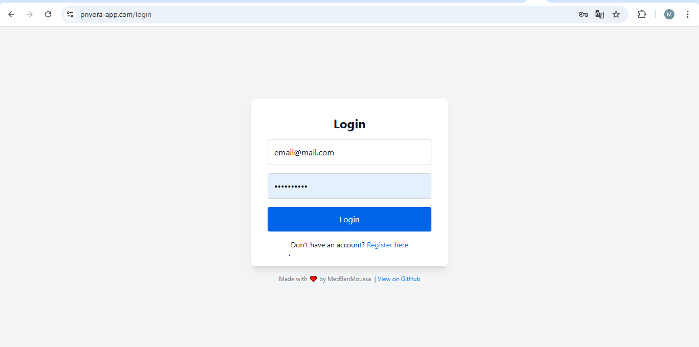

# 🛡️ Privora-GUI

**Privora** is a secure, privacy-focused chat application.  
This repository contains the **frontend user interface**, built with **React**, **TypeScript**, and **Tailwind CSS**, and designed to run inside a Docker container.


---

## 📦 About the Project

This is the graphical user interface (GUI) for the Privora chat app, focusing on:

- 💬 Secure messaging
- ⚛️ Modern UI with React
- 🎨 Tailwind-powered styling
- 🐳 Seamless Docker-based development

---

## 🔄 Clone the Repository

To clone the project to your local machine, run the following command:

```bash
git clone https://github.com/med1001/Privora-GUI
```

Then navigate into the project directory:

```bash
cd privora-gui
```

---

## ⚙️ Environment Configuration

Before running the project, you need to create a `.env` file in the root directory.

You can start by copying the provided template:

```bash
cp .env.example .env
```
Then edit the .env file to match your environment.

#### Example for Local Development

If you're running the backend locally (e.g., with `localhost:8000`), your `.env` file might look like this:

```env
REACT_APP_API_URL=http://localhost:8000
REACT_APP_WS_URL=ws://localhost:8000/ws/
```
These variables allow the app to connect to your desired API and WebSocket server, whether you're running locally or in production.

### Firebase Configuration Required

Before building the project (especially in Docker), you must create a Firebase config file for authentication to work.

Start by copying the example config:

    cp src/firebase-config.example.ts src/firebase-config.ts

Then edit `src/firebase-config.ts` and replace the placeholder values with your actual Firebase credentials:

You can find them in:  
Firebase Console → Project Settings → General → Your apps → SDK setup and configuration

Important: Never commit your real `firebase-config.ts` to version control. It's already listed in `.gitignore` for safety.

---

## 🐳 Getting Started with Docker

### 1. Build the Docker Image

```bash
docker build -t privora-gui .
```

### 2. Run the Container

```bash
docker run -p 3000:80 privora-gui
```

Then open your browser at:  
👉 [http://localhost:3000](http://localhost:3000)

---

## 🔁 Live Coding / Dev Mode

To enable hot reload while you code:

```bash
docker run -p 3000:3000   -v ${PWD}:/app   -v /app/node_modules   privora-gui
```

This lets you:
- Edit code on your host machine
- See changes live in the browser
- Avoid issues with `node_modules` being overwritten

---

## 🗂️ Project Structure

```
Privora-GUI/
├── LICENSE               # Project license
├── README.md             # This documentation file
├── node_modules/         # Installed dependencies (ignored by Git)
├── package-lock.json     # NPM lock file to ensure consistent installs
├── package.json          # Project dependencies and scripts
├── postcss.config.js     # PostCSS configuration (used by Tailwind CSS)
├── public/               # Public static files (e.g., index.html, favicon)
├── src/                  # React source code (components, hooks, etc.)
├── tailwind.config.js    # Tailwind CSS configuration
├── tsconfig.json         # TypeScript configuration
```

---

## 🔙 Backend Repository

You can find the backend source code here:  
👉 [Privora Backend](https://github.com/med1001/Privora)

---

## 🖼️ Screenshots

### 🔐 Authentication Page



### 💬 Chat Interface


> To be done : place screenshots in a `screenshots/` folder inside the root directory and name them `login.png` and `chat.png`.

---

## 📄 License

GNU General Public License v3.0 — see the [LICENSE](./LICENSE) file.
